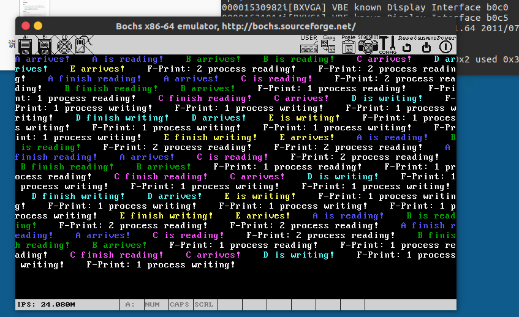

# OS-lab4说明文档

> 191250187 余欣然 软件学院
>
> 2021.12

## 系统调用

### 说明

- 修改`const.h`中的`NR_SYS_CALL`调用数，及`global.c`中的系统调用表数组增加相应的函数。
- 函数实现，具体来说共有睡眠（不分配时间片）、字符串打印、p操作和v操作四个函数，并相应声明。
- 修改`syscall.asm`，完善调用的函数体，并添加相应定义声明
- 参数个数有改变，因而需要修改`kernel.asm`中的`sys_call`函数

### 具体实现

`proc.c`中的四个函数具体实现

```c
/*======================================================================*
                           sys_sleep
 *======================================================================*/
PUBLIC void sys_sleep(int  milli_seconds){
	p_proc_ready->wake_time = get_ticks() + milli_seconds / 1000 * HZ;	// 修正
	schedule();
}
/*======================================================================*
                           sys_myprint
 *======================================================================*/
// 颜色输出
PUBLIC void sys_myprint(char * str){
	int color = colors[p_proc_ready - proc_table];
	disp_color_str(str, color);
}
```

`syscall.asm`中的调用实现，以彩打字符函数为例

```assembly
; ====================================================================
;                              myprint
; ====================================================================
myprint:
	mov eax,_NR_myprint
	mov ebx, [esp + 4]
	int INT_VECTOR_SYS_CALL
	ret
```

修改`kernel.asm`中的`sys_call`函数

```assembly
; ====================================================================================
;                                 sys_call
; ====================================================================================
sys_call:
		; 参数个数变动时修改
        call    save

        sti

		push esi
		push ebx
        call [sys_call_table + eax * 4]
		add  esp, 4
		pop  esi
        mov  [esi + EAXREG - P_STACKBASE], eax

        cli

        ret
```

## PV操作

P、V操作的具体实现

```c
/*======================================================================*
                           sys_p
 *======================================================================*/
PUBLIC void sys_p(SEMAPHORE* s){
	disable_irq(CLOCK_IRQ);
	s->value--;
	if(s->value < 0){
		p_proc_ready->wait_sem = 1;
		s->list[s->tail] = p_proc_ready;
		s->tail = (s->tail + 1) % SEMAPHORE_SIZE;
		schedule();
	}
	enable_irq(CLOCK_IRQ);
}
/*======================================================================*
                           sys_v
 *======================================================================*/
PUBLIC void sys_v(SEMAPHORE* s){
	disable_irq(CLOCK_IRQ);
	s->value++;
	if(s->value <= 0){
		s->list[s->head]->wait_sem = 0;
		s->head = (s->head + 1) % SEMAPHORE_SIZE;
	}
	enable_irq(CLOCK_IRQ);
}
```

## 时钟调度

`clock_handler`函数基本没有修改，主要改动了`schedule`函数，具体如下：

```c
PUBLIC void schedule()
{
	PROCESS* p = p_proc_ready;
	while(1){
		int t = get_ticks();
		p++;
		// 超出范围则回到第一个
		if(p >= proc_table + NR_TASKS){
			p = proc_table;
		}
		// 遍历搜索，找到一个不在睡眠且没被阻塞的则跳出循环
		if(p->wait_sem == 0 && p->wake_time <= t){
			p_proc_ready = p;
			break;
		}
	}
}
```

## 读写优先

读写操作注意互斥信号量的处理、计数时信号量的限制、最大读者数和实际在读数即可。

### 读优先

```c
//读者优先，读函数部分
myprint(name);
myprint(" arrives!    ");
p(&rmutex);
if(readcount == 0) {
    p(&wmutex);
}
readcount ++ ;
v(&rmutex);
// 正在读，控制最多读者数
p(&max_reader);
reading_num++;
myprint(name);
myprint(" is reading!    ");
milli_delay(slice_num * TIME_SLICE);
reading_num--;
v(&max_reader);
// 读完
p(&rmutex);
readcount--;
if(readcount == 0) v(&wmutex);
v(&rmutex);
myprint(name);
myprint(" finish reading!    ");

// 写函数部分
myprint(name);
myprint(" arrives!    ");
p(&wmutex);
myprint(name);
myprint(" is writing!    ");
milli_delay(slice_num * TIME_SLICE);	
v(&wmutex);
myprint(name);
myprint(" finish writing!    ");
```

### 写优先

```c
//写者优先，读部分
myprint(name);
myprint(" arrives!    ");

p(&x); // 只让一个读进程在rmutex上排队
p(&rmutex);
p(&readcount_control); // 互斥对readcount的修改
readcount++;
if(readcount == 1) {
    p(&wmutex);	// wmutex和rmutex保持互斥
}
v(&readcount_control);
v(&rmutex);
v(&x);

p(&max_reader);
reading_num++;
myprint(name);
myprint(" is reading!    ");
milli_delay(slice_num * TIME_SLICE);
reading_num--;
v(&max_reader);

p(&readcount_control);
readcount--;
if(readcount == 0) v(&wmutex);
v(&readcount_control);
myprint(name);
myprint(" finish reading!    ");

// 写部分
myprint(name);
myprint(" arrives!    ");
p(&writecount_control);
writecount++;
if(writecount == 1) p(&rmutex);
v(&writecount_control);

p(&wmutex);
myprint(name);
myprint(" is writing!    ");
milli_delay(slice_num * TIME_SLICE);
v(&wmutex);

p(&writecount_control);
writecount--;
if(writecount==0) v(&rmutex);
v(&writecount_control);
myprint(name);
myprint(" finish writing!    ");
```

### 打印读写数进程

```c
void TestF(){
	while(1){
		disp_str("F-Print: ");
		if(readcount > 0){
			char x[2];
			x[0] = reading_num + '0';	// readcount是阻塞+在读进程总数，reading_num是实际在读进程数
			x[1] = '\0';
			disp_str(x);
			disp_str(" process reading!    ");
			
		}
		else{
			// 只可能同时有一个进程在写操作
			disp_str("1 process writing!    ");
		}
		sleep(TIME_SLICE);
		if(disp_pos >= 80 * 50) clean_screen();
	}
}
```

### 进程饿死

这里直接采用了操作最为便捷的读者写者单次运行结束后睡眠一定时间，给其余进程运行的时间机会。

另，也尝试了使用读写公平的方式解决饥饿，具体来说读者的代码同写者优先情景类似，而写者代码如下

```c
else if(STARVATION){
    myprint(name);
    myprint(" arrives!    ");
    p(&x);
    p(&wmutex);
    myprint(name);
    myprint(" is writing!    ");
    milli_delay(slice_num * TIME_SLICE);	
    v(&wmutex);
    v(&x);
    myprint(name);
    myprint(" finish writing!    ");
}
```

